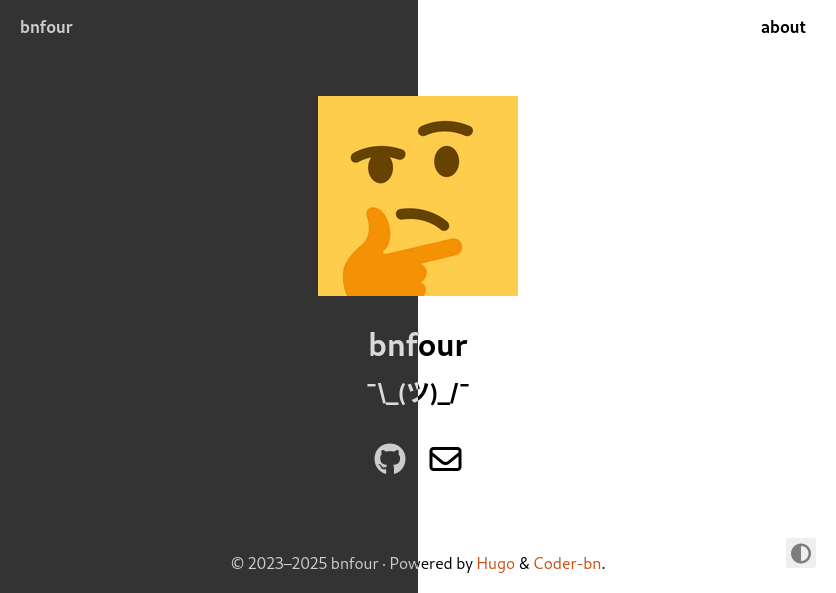

# Hugo-coder _fork_
_(also known as hugo-coder-bn and/or Coder-bn)_

> [!IMPORTANT]  
> This repo hosts and describes the changes to a theme I made for my personal website. For general info about the theme, including installation and documentation, please visit the [upstream repo](https://github.com/luizdepra/hugo-coder).

A simple and clean "blog" theme for [Hugo](https://gohugo.io/), now even more minimalistic. Based on original [hugo-coder](https://github.com/luizdepra/hugo-coder) theme.



## Live demo
This theme is used on my personal website — https://www.bnfour.net/  
There is not a lot of content there.

## Fork features
Differences from the upstream I can remember:
- Very infrequent updates  
I remember I have this site up once in multiple years ¯\\\_(ツ)\_/¯
- The best error page known to mankind  
(subjectively) (shared with my other websites)
- Different color palette  
To match my other websites
- Carousel for multiple scrolling `<h2>` subheaders on the home page  
Inspired by [this example](https://codepen.io/paras594/pen/JzjwJK)
- Removal of some things I consider nonessential  
Like most of animated transitions, some social metadata, integrity attributes for scripts from the same host anyway, _etc_
- Other various small changes  
Like square avatar, n-dash as years separator in the footer, different weight for Font Awesome icons, _etc etc_

All these changes are available in the [`style-customization`](https://github.com/bnfour/hugo-coder/tree/style-customization) branch of this repo.

### Carousel configuration
To use the home page carousel, set `info` in the `params` section to a string array in `hugo.toml`:
```toml
[params]
    info = ["Time stopper!", "Long sleeper!", "Easy gamer!"]
```

Markdown formatting in these strings will be rendered.

> [!TIP]  
> If `info` is set to a single string, the custom layout, CSS, and JS are not rendered for backward compatibility.

#### Known limitations
Other parameters you might want to customize are hardcoded, including (but not limited to):
- display width of the scroller; in CSS
- scroll timings (delay between scrolls, transition time); in JS
